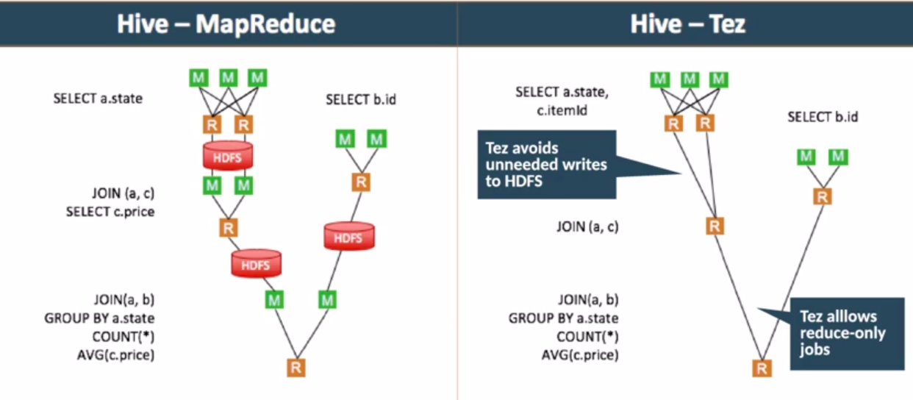

Cloudera CDP Administrator Private Cloud Base
============================

This is a study guide I built while studying to get CDP Administrator  Private Cloud Base (CDP-2001) certification.  I wish it helps to someone interested while having a good time as I had.

This guide has all the documentation to achieve the CDP Administrator Private Cloude Base (CDP-2001) Certification, and at the same time it gives you the oportunity to learn all the tecnologies  to manage a CDP Cluster efficiency following best practices and recommendations from Cloudera.


Table of Contents
--------------------

**General Concepts**
-	[Cloudera Data Platform](#Cloudera-Data-Platform) 
-	[CDP Private Cloud Base](#CDP-Private-Cloud-Base)

**Specific topics** 
-	[Cloudera Manager](#Cloudera-Manager) 
-	[CDP Installation](#CDP-Installation)
-	[Cloudera Runtime](#Cloudera-Runtime)
-	[Cluster State Management](#Cluster-State-Management)
-	[Types of hosts](#Types-of-hosts)
-	[Multiple Cluster Management](#Multiple-Cluster-Management)
-	[Add a cluster](#Add-a-cluster)
-	[Usage of Provisionig Tools](#Usage-of-Provisionig-Tools)
-	[Ansible](#Ansible)
-	[Configuration Settings](#Configuration-Settings)
-	[Configuration Levels](#Configuration-Levels)
-	[Cluster Configuration](#Cluster-Configuration)
-	[Services supported by Cloudera Manager but not part of CDP](#Services-supported-by-Cloudera-Manager-but-not-part-of-CDP)
-	[Install Add-on Service from Parcel](#Install-Add-on-Service-from-Parcel)
-	[Cluster size](#Cluster-size)
-	[Removing a host from the cluster](#Removing-a-host-from-the-cluster)
-	[Multiple Cluster](#Multiple-Cluster)
-	[HDFS](#HDFS)
-	[YARN](#YARN)
-	[Apache Hadoop MapReduce](#ApacheHadoopMapReduce)
-	[TEZ](#TEZ)
-	[Hive on Tez](#Hive-on-Tez)
-	[Hive 3 Architecture](#Hive-3-Architecture) 
-	[Hive Upgrade Considerations to CDP](#Hive-Upgrade-Considerations-to-CDP)
-	[ACID Operations](#ACID-Operations)
-	[Apache Spark](#Apache-Spark)
-	[Spark Distributed Processing](#Spark-Distributed-Processing)
-	[Apache Phoenix](#Apache-Phoenix)

**Legal**
-	[References](#References) 
-	[Disclaimer](#Disclaimer)
-	[License](#License)

Cloudera Data Platform
--------------------------

"Cloudera Data Platform (CDP) is a hybrid data platform designed for unmatched freedom to choose—any cloud, any analytics, any data.
CDP delivers faster and easier data management and data analytics for data anywhere, with optimal performance, scalability, and security.
With CDP you get the value of CDP Private Cloud and CDP Public Cloud for faster time to value and increased IT control." ([Cloudera](https://www.cloudera.com/products/cloudera-data-platform.html))

In this guide we are focusing in CDP Private Cloud only.  But in cloudera docs you can find information about Public Cloud.


CDP Private Cloud Base
--------------------------

It is an on-premises version of Cloudera Data Platform.  This product is the result of the Cloudera Enterprise Data Hub and Hortonworks Data Platform (HDP) combination along with some new features and improvements.  

When installing a CDP Private Cloud Base cluster, you install a single parcel called Cloudera Runtime that contains all of the components. For a complete list of the included components, see [Cloudera Runtime Component Versions](https://docs.cloudera.com/cdp-private-cloud-base/7.1.8/runtime-release-notes/topics/rt-pvc-runtime-component-versions.html).

In addition to the Cloudera Runtime components, CDP Private Cloud Base includes powerful tools to help manage, govern, and secure your cluster, like Apache Atlas, Apache Ranger, Apache Spark, Apache Zookeeper, etc.  CDP also includes a powerful tool to manage one or more clusters and their configuration, and also, monitor cluster performance of the clusters and their services. This tool is called Cloudera Manager.

Cloudera Manager
--------------------

As mentioned before, this tools is used to manage the clusters and their services, but you can also use Cloudera Manager to execute installations, upgrades, maintanance workflows, encryption, access controls, and replication.

In other words, It is a web application used by administrators to:

-	Add a cluster (s)
-	Start and stop the cluster
-	Start and stop services
-	Manage hosts
-	Manage cluster resources
-	Monitor cluster (s)
-	Configure cluster (s)
-	Manage users and security 
-	Upgrade the cluster

### Before installing Cloudera Manager

**Pre-install consideratons**

-	Create a plan for storage space.  This plan should consider logs, configuration files and data to be stored in HDFS.
-	Configure network names.  This must be configure in DNS and /etc/hosts to a better performance.
-	Disabled firewall for each host in the cluster
-	Temporarily disable SE Linux
-	Enable NTP service.  Not configuring this step might cause several sincronization problems.
-	Configure parcel repositories.  This can be local or remote repositories, it depends if you have a temporal or permanent internet access.

**Configuration Terminology**

-	**Service:**  A set of related components providing a type of hadoop functionality on a cluster.  Examples: YARN, Spark, Hive, etc.

-	**Role:**  An individual component of a service.  Examples: HDFS NameNode, HDFS DataNode, etc.

-	**Role Instance:**  Would be a daemon that runs on a specific host.  For example, a DataNode daemon running on a specific host would be an instance of that role.  For gateway roles, there's no daemon running but usually there's a set of client files or configuration files that are available on those nodes.

-	**Role Group:**  It is a set of roles distributed across multiple hosts with the same configuration.  Example:  A set of DataNode roles with default settings (the same configuration).  Role groups are designed to make configuration management a little bit easier and also we can create our own role group as needed.


CDP Installation
--------------------

**Configure repositories**

We are going to need to configure a local or public repository, and it will be saved at */etc/yum.repos.d/.  Repositories for Cloudera Manager (CM) and CDP Runtime are necessary.  Also, we need to have an active subscription of our Operating System to update and install some dependencies.

**Install JDK**

The Java Development Kit (JDK) is a distribution of Java Technology by Oracle Corporation. It implements the Java Language Specification (JLS) and the Java Virtual Machine Specification (JVMS) and provides the Standard Edition (SE) of the Java Application Programming Interface (API). It is derivative of the community driven OpenJDK which Oracle stewards. It provides software for working with Java applications. [Wikipedia](https://en.wikipedia.org/wiki/Java_Development_Kit)

We are going to use Java applications during the installation, for this reason it is extreamly important to install JDK.  We can install it manually or let the Cloudera Manager Wizard install it for us.  In any case, it is importat to remember that we need to install it on all cluster hosts.

-	**Supported JDKs for CDP Private Cloud Base 7.1.x**
	-	OpenJDK 1.8
	-	OpenJDK 11
	-	Oracle JDK 1.8

-	**Requirements** 
	-	It must be 64 bits
	-	The same version on each host
	-	Must be installed at */usr/java/jdk-version*

**Enable Auto-TLS (Recommended)**

Transport Layer Security (TLS) is a cryptographic protocol designed to provide communications security over a computer network. [Wikipedia](https://en.wikipedia.org/wiki/Transport_Layer_Security)

This protocol gives you security over our cluster, e.g., avoid a malicious host installing a Cloudera Manager Agent and joining to our cluster.

We can configure TLS manually using your certificate authority or automatically with Auto-TLS (Recommended by Cloudera).

-	**Benefits of Auto-TLS**
	-	Auto-TLS automates the creation of an internal certificate authority (CA).
	-	All hosts and services will automatically have TLS configured and enabled.	

**Install Cloudera Manager**

Ones we have the repositories ready, we proceed to install CM.  Cloudera Manaager (CM) is installed on the Cloudera Manager Server host.  This is an example of the command using RHEL as OS.

```
sudo yum install cloudera-manager-daemons cloudera-manager-agent cloudera-manager-server
```

**Install and configure Databases**

We are going to need internal or external databases to store the metadata of these services:

-	CM Server
-	Oozie Server
-	Sqoop Server
-	Reports Manager
-	Hive Metastore Server
-	Hue Server
-	Ranger
-	Schema Registry
-	Streams Messaging Manager

	**Command to setup CM Database**
	
```
sudo yum install cloudera-manager-daemons cloudera-manager-agent cloudera-manager-server
```

**Install CDP Runtime and other software**

In this step we are going to need CDP Runtime and parcels to install the services to be used in our cluster.


**Set up a cluster using the wizard**

The wizard is going to guide us through all the installation process.  It's very friendly and easy to use.


Cloudera Runtime
---------------------

Cloudera Runtime is the core open-source software distribution within CDP that Cloudera maintains, supports, versions, and packages as a single entity. Cloudera Runtime includes multiple open-source projects, including Apache components, connectors and encryption components, and other components from Cloudera. These components constitute the core distribution of data management tools within CDP.  [Dell](https://infohub.delltechnologies.com/l/white-paper-data-management-with-cloudera-data-platform-on-dell-infrastructure-1/cdp-private-cloud-base-components-3)

-	**Does not include:**
	-	Cloud services like Data Hub, DWX and MLX
	-	Management Console, Workload Manager and Replication Manager
	-	Data Catalog
	-	Add-on products such as CDSW, CDF, Cloudera DataFlow, etc.

-	**What CDP includes "out of the box"?**

	| Component	| Description	|
	| ---------------	| ----------------	|
	| Apache Hadoop    			| Distributed batch processing of large datasets       				| 
	| Apache HBase   			| NoSQL database, sits on top of HDFS (Hadoop Distributed File System) so it gains the fault tolerance HDFS gives it, but is for structured storage of very large tables	|
	| Apache Hive				| Is the data warehouse, summarization and had-hoc querying tool		|
	| Hive Metastore (HMS)		| It is the metadata information for hive/impala tables				|
	| Apache Oozie				| A workflow scheduler										|
	| Apache Parquet			| Columnar storage format	|
	| Apache Spark				| Compute engine used for ETL, ML and stream processing	|
	| Apache Sqoop	| Is the way for us to pull data out of structure data sources like database management systems (Oracle, MySQL, etc) and bring that data from those sources into our cluster	|
	| YARN	| Job scheduling and cluster resource management	|
	| Apache Zookeeper	| Coordination service for distributed applications	|
	| Apache Atlas		| Metadata Management and governance and data catalog	|
	| Apache Phoenix	| OLTP, a real SQL access of large data	|
	| Apache Ranger	| Manage security on our data	|
	| Apache ORC		| Columnar storage format for hadoop	|
	| Apache Tez		| The framework for running hive queries	|
	| Apache Avro		| Data serialization system			|
	| Hue			| SQL workbench for data warehouses	|
	| Apache Impala	| Distributed MPP SQL engine, very fast engine for data	|
	| Apache Kudu		| The column oriented data store	|
	| Apache Solr		| Enterprise search platform	|
	| Apache Kafka		| A real time streaming data pipelines and applications	|


[Back to top :arrow_up:](#table-of-contents)

Cluster State Management
-----------------------------

The CM Server maintains the state of the cluster in words of two categories; *Model and Runtime*.  This information is stored in the CM Server Database.

**Model State**

This is how the cluster is supposed to run, where and what configuration is supposed to run within.  For example, if you have a cluster with 15 hosts and each one run datanode daemon.  When you update a configuration, you are updating the model state.

**Runtime State**

It captures the processes, where and what commands are currently running.  The Runtime includes the exact configuration files needed to run a process.


Types of hosts
-----------------

There are three types of nodes; Master, Worker and Gateway hosts.

**Master Hosts**

These hosts exist for roles that coordinate or manage a specific service on our cluster.  For example:

-	HDFS NameNode
-	YARN ResourceManager
-	Job history servers
-	Zookeeper 

**Worker Hosts**

These are for roles that do the distributed work for a specific service.  The following are examples of some typical service roles.

- 	HDFS DataNode
-	YARN NodeManager
-	Impala Daemons

**Gateway hosts**

These kind of hosts *do not run daemons*, but they do have information needed to provide some kind of service, for example, they can act as a gateway and the gateway role basically allows people outside the cluster to access the cluster itself.

These clusters are sometimes referred to as *edge nodes* or *edge hosts*.

Some typical roles are:

-	HDFS gateway
-	YARN gateway
-	Hive gateway
-	Spark2 gateway
-	sqoop
-	Hue server
-	HiveServer2

Multiple Cluster Management
--------------------------------

We can have one instance of Cloudera Manager Private Cloud and manage multiple clusters with it.


Add a cluster
---------------

As we mentioned before, we can add multiple clusters using our same CM instance.  When adding a cluster we are going to need this following information.

-	Cluster Name
-	Cluster type	
	-	CM will ask for this when we are adding a 2nd, 3th and subsquent cluster
	-	Our first cluster is going to be *Regular* type by default and we do not have a choice here.
	
**Cluster types**

After the first cluster we can also do a **regular cluster** which has storage nodes and compute nodes and all the services available, or we can install a **compute cluster** which consists of only the compute nodes.  In this case you would connect to some kind of existing storage, existing metadata, existing security services, so that compute cluster would only be responsible for computation which means we can tune the cluster just for that one service.

Usage of Provisionig Tools
-----------------------------

Managing the provisioning of servers can be very costly, for this reason we usually use a product like ansible that helps with automate provisioning, configuration management, and application deployment.

Ansible has the advantage to be an open-source tool.

Ansible
--------

Ansible is an open source community project sponsored by Red Hat, it's the simplest way to automate IT. Ansible is the only automation language that can be used across entire IT teams from systems and network administrators to developers and managers [ansible.com](https://www.ansible.com).

Here are some key point of Ansible:
-	It is NOT a server-agent architecture, everything works through ssh.
-	It works through JSON files and can therefore be written in any programming language.
-	It is constructed into roles, playbooks and tasks.
-	Ansible can also use YAML files to ensure flexibility and modular code development.
-	With CDP, Ansible provides a fully end-to-end, production ready deployment
	-	It installs the requiere OS packages and configs
	-	Installs and prepares supporting infrastructures (Databases, Kerberos, TLS, etc)
	-	Deploys CDP Private Coud Base clusters
	-	Enables security, encryption and High Availability (HA)
	-	Schedules CDP to spin up or down data hubs and experiences
	-	Adds local config, datasets and apps
	
As you can see, it can REALLY automates our implementation.


Configuration Settings
------------------------

Cloudera actually auto-configs some initial values for the *role groups* when we create a cluster.  They may not be the Apache default values though may override any of these values.

Configuration Levels
----------------------

We can override initial property settings and can be set at different levels as follow.

-	Service
-	Role group
-	Role instance

The settings are *inherited* from higher levels and the order of priority goes from lowest to highest, like this:  Service -> Role group -> Role instance

It means that anything set at the service is inherited by the *Role Group*, and *Role Instance* settings override *Role Group* and *Service* settings.

Cluster Configuration
-----------------------

There are over 1,800 cluster and service properties that can be configured.  Hidden properties use the cloudera default value that is set within the service parcel or package JAR File.

**Locating a configuration property**

They ways to find a property in the Cloudra Manager are:

-	Writing it on the global search box
-	Search box on a specific service's config page.

Take note that the blue arrow indicates the current value is not the default.

**Stale configuration**

When there's a change on the configuration of any service.  That change needs to be pushed out to the nodes in the cluster that it applies to, for this reason a modified configuration may require one or both of the following actions:

-	Client redeployment
-	Role instance restart or refresh

**Advanced configuration snippets (safety values)**

We can use this values to define additonal configurations.  Maybe there is a specify a value and the property does not exit in the service configuration, in that case we create an *advanced configuration snippet* and we finally overide setting for properties not exposed in Cloudra Manager.

**The Cloudera Manager API**

This is used to manage the cluster programmaticaly.  We can deploy a cluster, configure, monitor start and stop services, configure HA and more.

Here are some consideration to use the API:

-	Access using curl or included client libraries
-	Python or Java clients are recommended
-	There is a Swagger UI provided for this API
-	The API accepts HTTP POST, GET, PUT and DELETE methods. It accepts and returns JSON formatted data

We can use the API to automate cluster operations such as:

-	Obtain configuration files
-	Back up or restore the CM configuration
-	Automate different process within our cluster
-	Import/Export CM configuration

**Configuration Files on Cluster hosts**

Cloudera Manager deploys configuration settings to the Agents and they are responsible for deploying the configuration settings.  The settings ara saved to local files but before this, the agent pulls daemon configuration settings from the Cloudera Server.  It is important to remember that these settings apply to service daemons like YARN Resource Manager, NameNode or DataNode.

The client settings are used by client application and command line tools to access cluster services.  These clients typically run on gateway nodes.

Service and client configuration settings are stored seperately and each daemon has a seperate configuration file.

Service configuration settings apply to a daemon that is running, so it undestand the configuration setting needed on that machine for that daemon to run.

The default location for service daemon configuration files is */var/run/cloudera-scm-agent/process/*.

**Client configuration files**

Cloudera Manager creates client files with settings needed to access cluster services.  Those are things that are needed for the client to access the cluster, which is what our gateways do, they access to the cluster.

The client configuration files are generated by Cloudera Manager when:

-	A cluster is created
-	A service or a gateway role is added on a host.

A gateway role includes client configuration, libraries, and binaries, but no daemons.  This is a very important thing to remember.

**Cluster-wide configurations**

Review or modify setting, including:

-	Non-default value configuration setting
-	Log directories
-	Disk space thresholds
-	Advanced configuration snippets

 **Role Instance Management Tasks**
 
Here are the most frecuently tasks to execute by the CM Administrator on Role Instances.

-	Add additional role instance after the service is created.
-	Start/stop/restart role instance
-	Decomission a role instance
	-	This removes the role instance while the cluster is running and without losing data.
-	Delete the role
	-	We'll decommisision it before it deletes it.
	-	Deleting a gateway role removes the client libraries
	- 	Does not delete the deployed client configuration

Services supported by Cloudera Manager but not part of CDP
------------------------------------------------------------------

-	Anaconda
-	Cloudera Data Science Workbench (CDSW)
-	Apache Sqoop Connectors

In case we need to use them, we can add them in as add-on service.  These are distributed as packages or cloudera manager parcels and they may be provided by Cloudera or by an independent software vendor.

Install Add-on Service from Parcel
-------------------------------------

This installation requires a parcel and usually a custome service descriptor (CSD) file that contains the configuration needed to download and manage the new service.  Following we can find the procedure:

-	Place the CSD file in */opt/cloudera/csd* in the Cloudera Manager Server host.
-	Restart Cloudera Manager Server and the Cloudera Manager Service.  We can restar this last one by actions in the service from Clouderea Manager, and the correct way to restart Cloudera Manager Server is by the following command.

```
sudo systemctl restart cloudera-scm-server
```
-	Then, from Cloudera Manager, go to Parcels to download, distribute and activate the parcel, each step in order.

Cluster size
-------------

A cluster can run on a single machine.  This scenario is only for testing and developing and it must not be used for production clusters.

Many organizations start with a small cluster and grow it as required, perpahs initially just 8 or 10 hosts and as the volume of data grows, more hosts can easily be added.

We should increase our cluster size when there is a need to increase computation, data storage and memory.


Removing a host from the cluster
------------------------------------

We have to methods to perform this activity, both will decomission and delete host's role instances and remove managed service software, while preserving data directories.

-	Remove it from *Cluster option*
	-	Keeps the host available to Cloudera Manager
	
-	Remove it from *Cloudera Manager Option*
	-	Cloudera Manager will no longer manage the host

Multiple Cluster
------------------

When we are working with multiple clusters, these do not need to run the same version of CDP or Cloudera Runtime.  The only thing is that Cloudera Manager need to be equal to or greater that the version that we are adding the cluster for.

Hadoop Data Storage
------------------------

Cloudera supports different storage platforms

-	**HDFS (Hadoop Distributed File System)**
	A hierarchical file-based storage

-	**Apache HBase**
	A NoSQL database buit on top of HDFS, so it gets the fault tolerance built into HDFS

-	**Apache Kudu**
	Table-based storage for fast processing and SQL Analytics	
	
-	**Cloud Storage**
	S3, Azure or Google
	
-	**Ozone**
	Scalable, redundant and distributed object store for Hadoop.  It basically functions in a containerized environment like Kubernetes and YARN.
	
HDFS
------

The Hadoop Distributed File System (HDFS) is a distributed file system designed to run on commodity hardware. It has many similarities with existing distributed file systems. However, the differences from other distributed file systems are significant. HDFS is highly fault-tolerant and is designed to be deployed on low-cost hardware. HDFS provides high throughput access to application data and is suitable for applications that have large data sets.  [hadoop.apache.org](https://hadoop.apache.org/docs/r1.2.1/hdfs_design.html) 

HDFS is a Java-based file system for storing large volumes of data. Designed to span large clusters of commodity servers, HDFS provides scalable and reliable data storage.

HDFS forms the data management layer of Apache Hadoop. YARN provides the resource management while HDFS provides the storage.

HDFS is a scalable, fault-tolerant, distributed storage system that works closely with a wide variety of concurrent data access applications. By distributing storage and computation across many servers, the combined storage resource grows linearly with demand.  [docs.cloudera.com](https://docs.cloudera.com/runtime/7.2.10/hdfs-overview/topics/hdfs-overview-of-apache-hdfs.html).

Here are some key concepts to keep in mind.

-	HDFS emulates an OS file system, but it is a virtual file system
-	It is really just a Java Application based upon Google's File System
-	Sits on top of native filesystem like ext3, ext4 or xfs
-	It is designed to provide redundant storage for big data, but to do this on relatively inexpensive industry standard hardware
-	Data is distributed at load time
-	We got physical disk storage with a native OS sitting on top of that, and then we've got HDFS, that sits on top of our native FS

**Options for accessing HDFS**

-	CLI (Command-Line Interface)
	-	hdfs dfs (synonym for hadoop fs)

-	Web browser
	-	Hue
	-	Cloudera Manager
	-	NameNode Web UI

-	Other Programs
	-	NFS Gateway:  Allows a client to mount HDFS as part of the local file system
	-	JAVA API: Used by MapReduce, Spark, Impala, Hue, Sqoop, and so on

-	RESTful interface
	-	WebHDFS and HttpFS

**HDFS Features**

-	High read throughput performance
-	Fault tolerance
-	Relatively simple centralized management
	-	Master/worker architecture
-	Security
	-	Optionally configured with Kerberos for secure authentication
-	Optimized for distributed processing
	-	Data locality
-	Scability
	-	We can grow it as big as we need to

**HDFS Characteristics**

-	Fault tolerant to handle component failure
	-	Failure is inevitable, we just want to be able to handle it when it does happen and HDFS does that.
-	Optimized for "modest" number of large files
	-	Millions of large files, not billions of small files
	-	Each file is likely to be 128MB or larger.  Multi-gigabyte files are typical
	-	128MB is the typical default block size
-	Files are inmutable
	-	Data can be appended, but a file's existing contents cannot be changed.
-	Designed for large streaming reads
	-	Favors high sustained throughput over low latency

**HDFS Replication**

-	Blocks are replicated to multiple hosts based on replicator factor
	-	Default replication factor is 3
-	Replication increases reliability and performance 
	-	Reliability: Data can tolerate loss of all but one replica
	-	Performance: More ooportunities for data locality, we have a block in 3 places so if we need to acess that, we got 3 shots at accessing it
	
**HDFS without High Availability**

We can deploy HDFS with high availability (HA) or without it.  Now, without HA we have a minimum of 3 daemons:

-	NameNode (Ona master node)
-	Secondary Namenode (On a master node)
-	DataNode (On a worker node)

The secondary NameNode **is not** a failover NameNode, it only handles checkpointing the file metadata.  It takes the metadata, image, and all the images that have happend to the metadata since that image was taken, and it makes a new image of that.  That image is like a snapshot in time.

If we lose our NameNode, then we can't access the data because that NameNode holds the metadata.  It knows what blocks constitute what file and where those blocks are.  Without that knowledge we can't access the files.  The DataNodes houses these blocks but they do not know what they're part of, in other words, they don't know what file they belong to.  Only the metadata on the NameNode does know.

**HDFS with High Availability**

This architecture eliminates the NameNode as a single point of failure having two NameNodes, one will be in active status and the other will be in standby status.  The standby NameNode takes over when active NameNode fails, and once the original active NameNode comes back online, it will come back in standby status, this means that we only have one active Namenode at any point in time. 

Secondary NameNode is not used in HA mode, because the standby NameNode will do that checkpointing.

**HDFS DataNodes**

Contents of files in HDFS are store as blocks on the worker hosts and each worker host runs a DataNode Daemon which is responsible for controlling access to these blocks and for communicating with the NameNode.  Every 3 seconds it sends a heartbeat to the NameNode, so the NameNode knows that it's available.

Blocks are simply files on the worker hosts' underlying filesystem.  Here are some block characteristics.
 
-	The blocks are named blk_xxxxx
- 	They are typically located in /dfs/dn folder, we can change it on dfs.data.dir property. 
- 	They are unware of which stored file a block is part of, or what file that block belongs to.  That information is only stored as metadata on the NameNode.  
-	That metadata is stored in RAM and most of it is persisted to disk.  The Metadata is loaded from disk when the NameNode daemon stars up.
	-	Its filename is fsimage (It is like a snapshot)
	-	Block locations are not stored in fsimage.  The block locatioons are only in RAM
	-	Changes to the metadata are stored in RAM and also written to an edits log (log file).
		-	The checkpointing happens when changes occur.

The actual raw data, the data stored in blocks never passes through the NameNode, no for reads, writes or during re-replication. The data goes directly to the DataNode daemons.

**NameNode Memory Allocation**

Memory allocation can be important for the namenode because it's going to keep all this metadata in memory, so it can be accessed quickly.

-	Default Java Heap size on the NameNode is 1GB
	-	At least 1GB recommended for every milliion HDFS blocks

-	In reality, items are stored in the namenode's metadata.  An item would be a file name, file ownership and permissions.  An item would be the name and locatio nof each of the blocks.
	-	Each item uses approx 150 to 250 bytes of memory

-	Fewer files requires less NameNode memory.  That's why we prefer fewer larger files than lots of little files.


YARN
------

Yet another Resource Negotiator (YARN), is a platform for managing resources for application on a cluster, so we've got a lot of applications submitted by a lot of people on a cluster and we have a finite number of resources to run them, so we need a way to manage those resources.  We want to guarantee the completion in a reasonable time frame for critical workloads, we want to support a reasonable scheduling between all kinds of groups of users.  At the same time we to prevent users from depriving other users access to the cluster.

**Frameworks for Distributed Applications**

-	Distributed processing applications use frameworks to provide:
	-	Batch processing
	-	SQL queries
	-	Search
	-	Machine Learning
	-	Stream processing

-	Framework provides applications access to data in the cluster
	-	HDFS, HBase, Kudu or object storage

-	Applications are tryint to access those resources with a finite amount of memory and processes to do that with
	-	YARN is going to manage that memory and those processors between applications requesting usage.

**Major Framworks on YARN**

-	MapReduce
	-	The original HAdoop applicaiton framework
	-	Proven, widely used
	-	Sqoop and other tools use MapReduce to interact with HDFS

-	Spark
	-	A big data processing framework
	-	It has buil-in modules for streaming, SQL, Machine Learnign and graph processing
	-	Supports processing of streaming data
	-	Faster than MapReduce for most workloads
	
-	Tez
	-	Provides a developer API and framework to write native YARN applications
	-	Tez is extensible and embeddable
	-	We use it for hive
	-	Has set the standard for true integration with YARN for interactive workloads
	-	Hive embeds Tez so that it can translate complex SQL statements into interactive and highly optimized queries
	
**YARN Benefits**

-	Diverse workloads can run on the same cluster
-	Memory and CPU shared dynamically between applications
-	Predictable performance
	-	Avoids "Oversubscribing" hosts, requesting more CPU or RAM than is actually available
	-	Allows higher-priority workloads to take precedence
-	Fully cluster utilization

**YARN Sevices**

-	Reserouce Manager
	-	Runs on a master host
	-	HA modeL two Resource manager per cluster.  One in active status and the oter in standby status.
	-	At least one per cluster: Classic mode
	-	It is responsible for scheduling the resources that are used on the worker host within the cluster, each of those worker hosts is running a NodeManager daemon.
	
-	NodeManager
	-	Manay per cluster
	-	Runs on worker hosts
	-	Is responsible for lanching the containers that have a certain amount of resources assigned to them, and lanching the applciatinos within those containers
	-	Manages resources used by applications
	-	NodeManagers are typically colocated with the DataNode daemons from HDFS because you want a process to take place where the data is stored when you can do that
	
-	MapReduce JobHistory Server
	-	One per cluster
	-	Runs on a master host
	-	It is responsible for historical information.  Once a job is completed by YARN, YARN doesn't care about all the metrics and historical information that's been generated, but we want to keep hold of that, so we use a JobHistory Server to do that.
	-	Spark has a seperate history server

**Applications on YARN**

-	Containers
	-	Allocated by resourceManager's scheduler
	-	Granted a specific amount of memory and CPU on a NodeManager host
	-	NodeManager launches these containers

-	ApplicationMaster
	-	We have one appliationMaster per application and these are framework spacific, so an applicationMaster for Spark would be different than ApplicaitonMaster for MapReduce.
	-	Run in a container, so the first container that gets launched, the applicationMaster gets launched there and then it's the Application Master's job to coordinate or supervise that application, so it requests additional containers that need to run on the other nodes in the cluster to access the data and process that data based upon the action or the reqeust of the ApplicationMaster has been given the application or the query

-	Each applicaiton consists of one or more containers
	-	The first container will house the ApplicationMaster, it will request the other containers where the other task will be run
	-	The application's distributed process run in other containers
		-	Process run in parallel, managed by an ApplicationMaster
		-	Process called executors in Spark and tasks in MapReduce

-	Applicatiosn are typically submitted from a gateway host to the Resource Manager

**Cluster Resource Allocation**

-	ResourceManager allocates one container for the application's ApplicationMaster

-	The ApplicationMaster requests additional containers from the ResourceManager
	-	Request include number of containers, preferred hosts or racks if any, required vcores and memory
	
-	ResourceManager allocates containers
	-	Passes locations and containers IDs to the Application Master

-	The ApplicationMaster distributes tasks to run in container JVMs

-	NodeManagers start container JVMs and monitor resource consumption


**Running and Application on YARN**

-	You as an end user would access a Gateway Node and submit your application
-	The submit would go to the ResourceManager
-	The ResourceManager would launch a container on one of the nodes in the cluster and launch the ApplicationMaster on it
-	The ApplicationMaster requests to the ResourceManager  the other resources it needs.
-	If those resources are available, the ResourceManager will assign those containers and they will be launched on the appropriate node
-	The ApplicationMaster will then send the task for the executer to launch within those containers
-	If you've got another application, it can be launched from a different gateway or the same gateway for that matter
-	The request goes to the ResourceManager, which launches another ApplicationMaster, which requests its resources and launch its taks or executions within the containers assiged to it
-	Neither of these applications will communicate with each other at any point in time
-	When they're done, they will respond back to the ApplicationMaster.  The ApplicationMaster will notify the ResourceManager to release those containers.  The results will be sent back to the client and the metrics will be sent on the history servers

**YARN Fault Tolerance**

-	If the ApplicationMaster stops sending heartbeats to the ResourceManger on your YARN application fails, the ResouceManager will reattempt the entire application two times (default)
-	If a task stops or exits with exception, then the ApplicationMaster will reattempt that task in a new container on a different host 4 times before it gives up on it
-	If that task fails too many times then the task is aborted
	
-	If our NodeManager fails or stop sending hearbeats to the ResourceManager:
	-	It will be removed from the active host
	-	Any task running on it will be treated as failed
	-	The task will be restarted up to four times
	-	If the ApplicationMaster host fails then it's treated as a failed application (started twice)
	
-	If your ResourceManager fails:
	-	You cannot launch a new application or a new task
	-	You can install resourceManager with HA, which means you have an active resource manager, and for some reason that active ResourceManager is not available, then the standby ResourceManager will go into active status.
	-	If the original ResourceManager comes back online, it does in standby status.  So, you only have one active available.
	
	
**Cloudera Manager YARN applications Page**

-	Use the YARN Applications tab to view
	-	Details about individual running or completed jobs
	-	Charts showing aggregated data by user, CPU usage, completion time, and so on.

**The ResourceManager Web UI**

-	Default URL http://yarn_rm_hosts:8088
-	IT has ResourceManager Web UI menu
	-	Queues
		-	Displays details of YARN queues
	-	Applications
		- 	List and fiilter applciations
		-	Link Spark, Tez or MapReduce ApplicationMAster UI (Active jobs) or history server (completed jobs)
	-	Services
		-	Create new YARN services and view the list of existing services
	-	Nodes
		-	Link NodeManagers and statuses
		-	Link to details such as applications and containers on the node
	-	Tools
		-	View configuration, YARN logs, server details
		-	Create standard services by providing their details or custom services by using JSON files containing definitions

**MapReduce Job HistoryServer Web UI**

-	The ResourceManager does not store details of completed jobs
-	MapReduce HistoryServer web UI archives jobs metrics and metadata
-	Role: JobHistoryServer (optional)
-	Port number 19888 (default)

**YARN Command Line**

-	Displays YARN applications details in the shell
	-	List all running applications
		$ yarn applicaton -list
		
	-	List all applications, including completed applications
		$ yarn application -list -appStates all
	
	-	Display the status of an individual application
		$ yarn application -status applicaton_ID
		
	-	Kill a running YARN application (Ctrl+C doesn't kill it)
		$ yarn application -kill aplicatio_ID
		
	-	You can also kill the application from the Hue Job Browser or from YARN applications tab in Cloudera Manager
		
-	Operating states: SUBMITTED, ACCEPTED, RUNNING

-	Initiating states: NEW, NEW_SAVING

-	Completion states: FINISHED, FAILED, KILLED

-	Some logs and command results list YARN application types: MAPREDUCE, YARN, SPARK, TEZ, OTHER


**YARN Application Log Aggregation**

-	Application logs are initially distriburted across the cluster
	-	Stored on NodeManager host local file systems
	-	Makes debugging difficult.  You have to figure out where did it run and then SSH into the node, find the log files and tat ca be very cumbersome.  So, what YARN does is it aggregates those logs.
	
-	YARN aggregates logs
	-	It's optional but it's recommended and it is enabled by default.
	-	Logs are aggregated by application 
	-	Access the logs from Cloudera Manager, any HDFS client , or the YARN command line interface
	
-	Rolling log aggregation is now Supported
	-	Responsible for aggregating logs at set time intervals
	-	You can configure that by the user
	-	Primary used for long-running appliations like Spark streaming jobs
	
-	For clusters with a large number of YANR aggregated logs:
	-	It can be helpful to combine them into Hadoop archives in order to reduce the number of small files
	-	The stress on the NameNode reduced as well
	
-	Container log files moved to HDFS when applications completes
	-	Default NodeManager local directory: /yarn/container-logs
		-	While application is running
	-	Default HDFS directory: /tmp/logs/user-name/logs
		-	After applicatoin completes
		
-	Application log retention window
	-	Apache default: indefinitely
	-	Cloudera Manager default: 7 days
	
		
Apache Hadoop MapReduce
-------------------------------

-	MapRecue is a framework, it was the original framwork for developing distribured applications
-	Hadoop MapReduce is part of the YARN service
-	Based on the MapReduce programming paradigm
	-	Record-oriented data processing
	-	Most applications have a map function and a reduced function.  The map function would extract data, the reduce function wold aggregate that data.
	
-	The applications are actually executed in those two phases
	-	Map-input records are processed on at a time
		-	Maper output sorted and saved to local disk
	-	Reduce-aggregates mapped data
		-	Reducers read mapper output

-	Data is shuffled between a NodeManager host running the map phase, and the NodeManager host runnig a reduced phase in many cases

-	MapReduce applications are usually written in Java

-	Some terminology that goes along with MapReduce is a Job

-	Job
	-	It is a mapper, reducer and a list of inputs

-	Task
	-	Is an indivitual unit of work, it's a map task or reduce task
	-	A job consists of one or more taks
	-	Each task runs in a container on a worker host
	
-	Client
	-	It is the program that submits the job to the ResourceManager

**How MapReduce Applications run on YARN**

-	There's one container created for each task, each map task or each reduce task and each container has a JVM that runs its task.  Containers are deleted once that task has completed.

-	The ApplicationMaster requests those tasks to work, preferably close to where the data blocks are sitting, on the same machine if possible but at least close by.  This is called data locality.

-	Data locality: We're going to process the data where it sits when we can

-	You can request specific hosts and the schedule will assign it to those hosts if at all possible.  If that host is not available, it will try to refer the same rack at least.

-	Start applications using the hadoop jar command
	$hadoop jar application-file.jar class-name arguments
	

**YARN Resource Configuration**

-	Set configuration properties for:
	-	Worker host resources, how much memory and CPU cores are available on each host?
	-	Container resource limits, how much memory and how many cores should each application be allowed?
		-	ResourceManager Scheduler allocates resource for containers
		-	Each container runs on applicatin task (map or reduce task)
	-	MapReduce applications, how much resources do applications request?
		-	Scheduler provides containers subject to limits

**The YARN Scheduler**

-	Cofigure CPU Scheduling
	-	YARN service, configuration tab
	-	Set Resource Calcultaro Class to the org.apache.hadoop.yarn.util.resource.DominantResoruceCalculator option
	-	Set yarn.nodemanager.resource.cpu-vcores to the number of vcores to match the number of Physical CPU cores on the NodeManager
	
-	Enable cgroups along with CPU scheduling to activate strict enforcement

-	With cgroups strict enforcement activated, each CPU process receives only the resources it requests

-	Without cgroups activated, the DRF scheduler attempts to balance the load, but unpredictable behavier may occur

TEZ
-----

-	A framwork for YARN-based, Data processing applications in hadoop
-	It's used by Hive, it's embedded into Hive
-	It's a framework designed for high performance batch and interactive applications.
-	Tez improves the MapReduce paradigm by dramatically improving its speed, while maintaining the ability to scale to petabytes of data
-	It's used by a lot of third party data access applications that are developed for the hadoop ecosystem.
-	In Cloudera Data Platform (CDP), Tez is usually used only by Hive
-	Apache Tez provides a developer API and framework to write native YARN applications
-	Hive embeds Tez so that it can translate complex SQL statements into highly optimized, purpose-built data processing graphs that strike the right balance between performance, throughput, and scalability


Hive on Tez
--------------



-	Hive on Tez avoids the writes to HDFS
-	Tez allows reduce only jobs.  We are able to back those up one after other
-	The JOINs and the COUNTs can be done in order, we don't have to save them in between
-	In CDP, the Hive MEtastore (HMS) is an independent service called Hive
-	MapReduce and Spark are no longer supported for Hive
-	Hive on Tez performs the HiveServer (HS2) role in a Cloudera cluster
-	Install the Hive service and Hive on Tez in CDP.  The HiveServer role is installed automatically during this process

Hive 3 Architecture 
---------------------

-	We've got two Hive Servers in green on the either side of that.
-	In the Hiver server is where our clients are going to send, the query is going to be compiled, optimized, execute it through Tez, so submit it to Tez.  That's our compute engine
-	Tez uses YARN to manage the resources
-	You can access Hive with SQL, BI clients as well
-	We seperate the Hive service configured for different types of queries.
-	ORC is an optimized file format that gets used a lot for Hive

Hive Upgrade Considerations to CDP
----------------------------------------

-	To assess the hardware and resource allocations for your cluster
	-	CDP does not support Hive on Spark.  Scripts that enable Hive on Spark do not work
	-	Remove set hive.execution.engine=spark from your scripts
	-	The CDP upgrade process tries to preserve your Hive configuration property overrides, however it does not perserve all overrides
	-	If you upgrade from CDH and want to run an ETL job, set configuration properties to allow placement on the Yarn queue manager
	-	Remove the hive user superuser group memebership
	-	Hive on Tez cannot run some queries on tables stored in encryption zones under certain conditions
	-	CDP Private Cloud Base stores Hive data on HDFS by default, but CDP Public Cloud stores Hive data on S3 by default

ACID Operations
------------------

-	Stands for aomicity, consistency, isolation, and durability
-	Perform ACID v2 transactions at the row level without configuration
-	A Hive operation is atomic
	-	The operation succeeds completely or fails; it does not result in partial data
-	A Hive operation is also consistent
	-	Results are visible to the application in every subsequent operation
-	Hive operations are isolated
	-	Operations are insolated and do not cause unexpected side effects for others
-	Hive operations are durable
	-	A completed operation is preserved in the event of a failure

-	Hive supports single-statement ACID transactions that can span multiple partitions
-	A Hive client can read from a partition at the same time another client adds rows to the partition

**Administrator Duties for ACID**

As administrator, you can:
-	Configure partitions for transactions
-	View transactions
-	View transaction locks
	-	Hive transactions, enabled by default, disables Zookeeper locking
	-	DbLockManager stores and manages all transaction lock information in the Hive Metastore
-	You can view a list of open and aborted transactions (SHOW TRANSACTIONS), it gives you:
	- 	Transaction ID
	-	Transaction state
	-	Hive user who initiated the transaction
	-	Host machine or virtual machine where transaction was initiated
-	To view transaction locks:
	-	Before you begin, check that transactions are enabled (default)
	-	Enter a hive query to check table locks:
		-	SHOW LOCKS mytable EXTENDED;
	-	Check partiton locks:
		-	SHOW LOCKS mytable PARTITION(ds='2018-05-01',hr='12') EXTENDED;
	-	Check schema locks:
		-	SHOW LOCKS SCHEMA mydatabase;
		
Apache Spark
---------------

-	Spark is a very fast distributed, general-purpose engine for large-scale data processing
	-	The spark application framework provides analytic, batch, and streaming capabilities

-	Spark provides a stack of libraries built on core Spark
	-	Core Spark provides the fundamental Spark abstraction: Resilent Distributed Datasets (RDDs)
	-	Spark SQL works with structured data
	-	MLlib supports scalabe machine learning
	-	Spark Streaming applications process data in real time
	
-	**RDDs** are the fundamental unit of data in core Spark
	-	Provide the low-level foundation of all Spark processes
	-	Very flexible but complicated to work with directly
	
-	**DataFrames and Datasets**  are newer 
	-	They are now the primary mechanisms for working with data in Spark applications 
		-	They're higher level than a RDD
	-	They represent data as a table
	-	Data can be queried using SQL-like operations such as select, where, join, etc.
	
-	CDP supports Apache Spark
	-	It supports Apache Livy for local and remote access to Spark through the Livy REST API
	-	It supports Zeppelin for browser-based notebook access to Spark
	-	Spark LLAP connector is not supported
	-	Spark 3 is available as a separate parcel
	
**Types of Spark Applciations**

-	Spark Shell
	-	Interactive Spark application for learning and exploring data
		-	Start with pyspark (python) or spark-shell (scala)

-	Spark standalone applications
	-	Runs as a batch operation on the cluster
	-	They can be Python, Scala or Java
	-	Start with spark-submit

**Spark Applications on YARN**

Spark applications run on YARN.  They run in a JVM on the gateway host

-	Executors run in JVM in containers on worker hosts
-	Each application has an Application Master
	-	Runs in a container JVM on the cluster
	
**Application Deployment Modes**

-	**Cluster Deployment Mode**
	-	Most common mode for standalone applications
	-	Spark driver runs in the ApplicationMaster on the cluster
		-	Minimal CPU, memory, or bandwidth requirements for client host
	-	If the client disconnects the application will continue to run 
	-	More secure.  Al communication happen between njodes within the cluster
		
-	**Client Deployment Mode (Default)**
	-	Spark driver runs in the clinet
		-	Client node may requiere additional CPU, memory, or bandwidth
	-	Required to run Spark Shell
	-	Less secure.  Driver needs to communicate directly with cluster worker hosts
	
-	**Configure spark_deploy_mode to change default**

		
Spark Distributed Processing
--------------------------------

-	Spark partitions the data in a RDD, DataFrame, or Dataset
-	Partitions are copied to differnet executors
-	Executors run tasks that operate on the data partition distributed to that executor
-	Multiple tasks on the same RDD, DataFrame or Dataset can run in parallel on cluster
-	A series of tasks tat all operate on the same data partition run within the same executor
-	I can consolidate that together and that's called pipelining.  Where that all those tasks can operate on teh same partition in a sigle task, pipeline them together
-	Some operations work on multiple partitions, such as joins and aggregations, then I need to put all that data together
-	data partitions are shuffled between executors.    So, there has to be a shuffling and a movement of that data, This is called a wide operation or a shuffle operation, it takes place so now my data has got to be moved, and I'll have different executors potentially to run these new tasks.


Apache Phoenix
------------------

-	Cloudera Runtime introduces Apache Phoenix
-	It is considered to be a massively parallel relational database engine that supports OLT use cases
-	It uses HBase as its backing store
-	Phoenix is a SQL layer for Apache HBase that provides an ANSI SQL interface
-	Enables software engineers to develop HBase based applications that operationalize big data
-	You can create and interact with tables in the form of typical DDL/DML statements


References
-------------
[docs.cloudera.com](https://docs.cloudera.com) \
[infohub.delltechnologies.com](https://infohub.delltechnologies.com)

Disclaimer
------------
The author of this content cannot guarantee the validity of the information found here. Please make sure that you understand that the information provided here is being provided freely, and that no kind of agreement or contract is created between you and any persons associated with this content or project. The authors and contributors do not assume and hereby disclaim any liability to any party for any loss, damage, or disruption caused by errors or omissions in the information contained in, associated with, or linked from this content, whether such errors or omissions result from negligence, accident, or any other cause.

License
---------
<a rel="license" href="http://creativecommons.org/licenses/by/4.0/"></a><br />This work is licensed under a <a rel="license" href="http://creativecommons.org/licenses/by/4.0/">Creative Commons Attribution 4.0 International License</a>.
